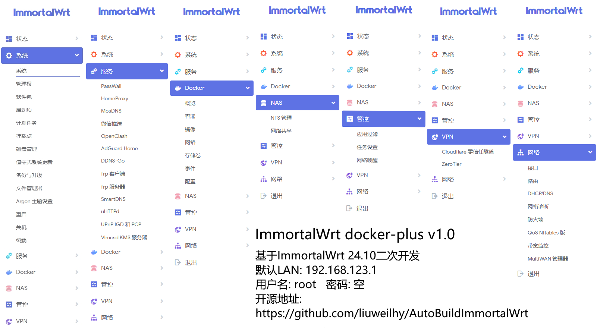

# ImmortalWrt ImageBuilder
这是一个fork自[wukongdaily/AutoBuildImmortalWrt](https://github.com/wukongdaily/AutoBuildImmortalWrt)的ImmortalWrt镜像构建工作流。  
在原作者的基础上，对24.10版本x86-64架构做了一些改动，增加了一些第三方插件，调整了部分插件菜单位置，说明如下：  
<table>
  <thead>
    <tr>
      <th colspan="2">基于ImmortalWrt的自编译固件</th>
    </tr>
  </thead>
  <tbody>
    <tr>
      <td>固件地址</td>
      <td><code>192.168.123.1</code></td>
    </tr>
    <tr>
      <td>用户名</td>
      <td><code>root</code></td>
    </tr>
    <tr>
      <td>密码</td>
      <td>无</td>
    </tr>
    <tr>
      <td>lite</td>
      <td>标准版本</td>
    </tr>
    <tr>
      <td>plus</td>
      <td>含其它非官方插件的版本</td>
    </tr>
    <tr>
      <td>docker</td>
      <td>含docker的版本</td>
    </tr>
    <tr>
      <td>docker-plus</td>
      <td>含docker及其它非官方插件的版本</td>
    </tr>
  </tbody>
</table>

其中包含的第三方插件：
1. PoweroffDevice关机插件: [https://github.com/sirpdboy/luci-app-poweroffdevice](https://github.com/sirpdboy/luci-app-poweroffdevice)
2. AdGuardHome去广告插件: [https://dl.openwrt.ai/packages-24.10/x86_64/kiddin9/](https://dl.openwrt.ai/packages-24.10/x86_64/kiddin9/)
3. Passwall插件: [https://github.com/xiaorouji/openwrt-passwall](https://github.com/xiaorouji/openwrt-passwall)
4. MosDNS插件: [https://github.com/sbwml/luci-app-mosdns](https://github.com/sbwml/luci-app-mosdns)
5. OpenClash插件: [https://github.com/vernesong/OpenClash](https://github.com/vernesong/OpenClash)

docker-plus版本界面： 

# 以下是原作者的README
# AutoBuildImmortalWrt

   

## 🤔 这是什么？
它是一个工作流。可快速构建 带docker且支持自定义固件大小的 immortalWrt
> 1、支持自定义固件大小 默认1GB  
> 2、支持预安装docker（可选） 
> 3、目前支持x86-64 和 rockchip 两个平台（后续会增加） 
> 4、新增支持MT3000/MT2500/MT6000/B2200（docker可选） 
> 5、新增全志平台R1S、香橙派Zero3等机型的工作流 
> 6、新增用户预设置pppoe拨号功能 
> 7、新增树莓派①②③④⑤ 

## 如何查询都有哪些插件?
https://mirrors.sjtug.sjtu.edu.cn/immortalwrt/releases/24.10.0/packages/aarch64_cortex-a53/luci/  
https://mirrors.sjtug.sjtu.edu.cn/immortalwrt/releases/24.10.0/packages/x86_64/luci/ 

## 该固件默认属性？(必读)
- 该固件刷入【单网口设备】默认采用DHCP模式,自动获得ip。类似NAS的做法
- 该固件刷入【多网口设备】默认WAN口采用DHCP模式，LAN 口ip为 192.168.123.1  其中eth0为WAN 其余网口均为LAN
- 若用户在工作流中勾选了拨号信息 则WAN口模式为pppoe拨号模式。
- 建议拨号用户使用之前重启一次光猫。
- 综合上述特点，【单网口设备】应该先接路由器，先在上级路由器查看一下它的ip 再访问。
- 上述特点 你都可以通过 `99-custom.sh` 配置和调整

## ❤️其它GitHub Action项目推荐🌟 （建议收藏）⬇️
https://github.com/wukongdaily/RunFilesBuilder 
https://github.com/wukongdaily/DockerTarBuilder

## ❤️如何构建docker版ImmortalWrt（建议收藏）⬇️
https://wkdaily.cpolar.top/15
# 🌟鸣谢
### https://github.com/immortalwrt
